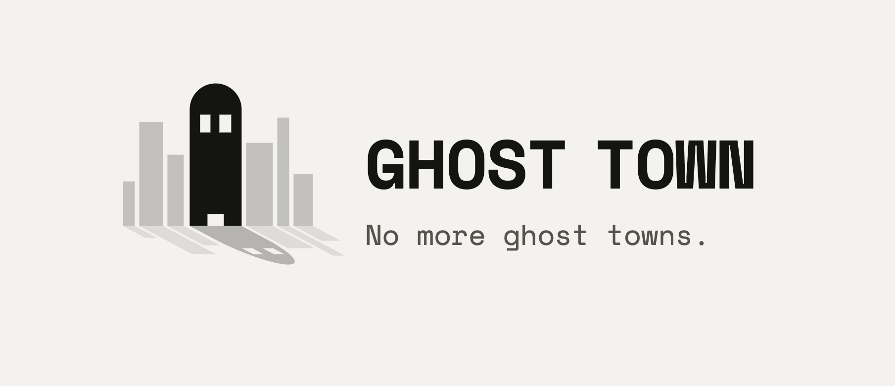
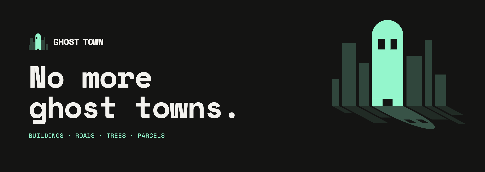
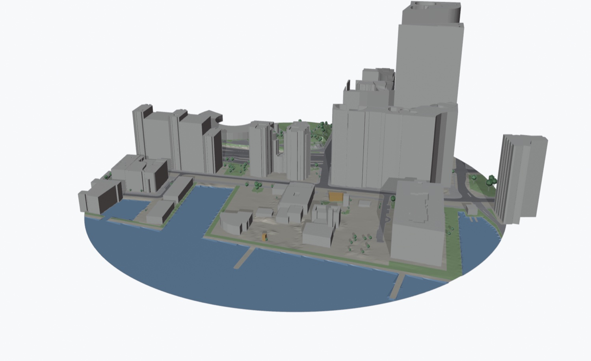
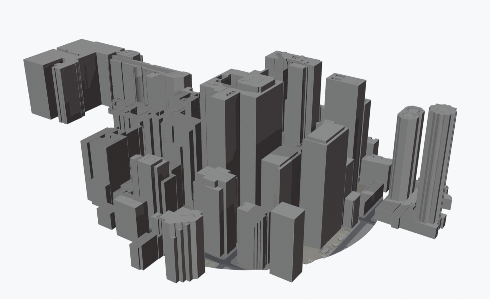

<p align="center">
  <picture>
    <source media="(prefers-color-scheme: dark)" srcset="media/brand/png/lockup/ghosttown-lockup-horizontal-dark.png">
    
  </picture>
</p>



# Ghost Town

**No more ghost towns.**

Type an address in Blender and get the city around it: buildings, terrain, roads, sidewalks,
water, parks, trees and lot lines, built from open data as clean geometry you can take into Revit or
any BIM tool.



*235 Queens Quay W, Toronto, 300 m radius, built in about 8 seconds. Data: City of Toronto and Natural
Resources Canada (see [Data and credits](#data-and-credits)).*

Ghost Town is a free, open-source extension for Blender 5.2 and later. It is at an early stage
(version 0.2): Toronto is covered in depth, and the rest of the world gets buildings only.

## What you get

| Where the site is | Buildings | Terrain | Ground, trees, lot lines | Address search |
|---|---|---|---|---|
| **City of Toronto** | City 3D Massing model, newest edition: stepped parts with measured heights | NRCan elevation, 2 m grid | Roads, sidewalks, parking, rail, water, parks, trees, parcels | Yes |
| **Elsewhere in Canada** | OpenStreetMap | NRCan elevation where available | Plain ground only | Not yet (type coordinates) |
| **Rest of the world** | OpenStreetMap | Flat | Plain ground only | Not yet (type coordinates) |

Each build makes one collection, `Context · <site>`:

- **Buildings:** one object per building. Each tier is a closed prism standing on the terrain.
  Buildings that cross the circle come in whole. In Toronto, parts of the City's model that touch or
  overlap form one building object, and where parts overlap the taller one wins. On a main street a
  whole block face can become one object; Separate › By Loose Parts splits it in Blender. Elsewhere in
  Ontario, with **LiDAR roofs** ticked, each building also gets a roof measured from the province's LiDAR,
  which you can switch to and simplify. Buildings from the City of Toronto's model keep its massing, the
  same flat-topped blocks the City publishes as SketchUp and AutoCAD files.
- **Ground:** one draped surface per kind (road, sidewalk, parking, rail, water, green, plain ground).
  The pieces share their edges, so there are no cracks or overlaps. Water lies flat at its shoreline.
- **Trees:** a trunk and a low-poly crown each, sized from the City's tree heights, merged into one object.
- **Parcels:** lot lines draped 15 cm above the ground.
- **Aerial photo** (Toronto): the City's newest aerial photo of the site, kept inside the .blend file,
  for the ground and low roofs. See [Use](#use).
- **Materials:** one per kind, named `Context - Building`, `Context - Road`, and so on. A building whose
  height had to be guessed is orange (`Context - Building (height guessed)`).
- **Location:** a `Context origin` empty at 0,0,0 holding the latitude, longitude, ground elevation above
  sea level, the origin's survey grid coordinates and the data credits.

Everything is in metres, with x east, y north, the address at the origin and z = 0 at its ground level.



*320 Bay St, Toronto, 300 m radius.*

## Install

Ghost Town needs **Blender 5.2 or later** on macOS (Apple silicon or Intel), Windows x64 or Linux x64.
It bundles the one library it needs (shapely), so there is nothing to `pip install`.

1. Download the zip for your computer from the [latest release](https://github.com/winterweken/GhostTown/releases/latest):

   | Your computer | File |
   |---|---|
   | macOS, Apple silicon | `ghosttown-<version>-macos_arm64.zip` |
   | macOS, Intel | `ghosttown-<version>-macos_x64.zip` |
   | Windows | `ghosttown-<version>-windows_x64.zip` |
   | Linux | `ghosttown-<version>-linux_x64.zip` |

2. In Blender, go to Edit › Preferences › Get Extensions › ⌄ › **Install from Disk…** and pick the zip.
3. Go to Edit › Preferences › System › Network and turn on **Allow Online Access**.

### Building it yourself

```bash
git clone https://github.com/winterweken/GhostTown.git
cd GhostTown
tools/build.sh
```

`tools/build.sh` downloads the shapely wheels from PyPI and writes one zip per platform into `dist/`.
It expects Blender at `/Applications/Blender.app`; on other systems, set `BLENDER` to your Blender
executable first. Install the zip as above.

## Use

1. In the 3D View, open the sidebar (N) and the **Ghost Town** tab.
2. **Location:** type a Toronto address such as `320 Bay St` and press the search button beside it. If
   several addresses match, pick one. Anywhere else, type `latitude, longitude`, for example
   `51.5074, -0.1278`.
3. **Site name** (optional) names the collection. A found address fills it in.
4. **Radius:** 150, 300, 500 or 1000 m.
5. **Fetch:** tick **Aerial photo** (on by default) to fetch the City of Toronto's newest aerial photo
   of the site with the build. It is kept inside the .blend file. Tick **LiDAR roofs (slower)** in Ontario
   to fetch the province's LiDAR and give buildings outside the City of Toronto's 3D Massing model a
   second, measured roof. It is a large download, and the province's server can take a minute to answer
   the first request.
6. Press **Build Context**. A 300 m site takes about 10 seconds and a 1000 m site about 20. With **LiDAR
   roofs** ticked a build takes a few minutes more, because the province's server is slow to send the LiDAR
   (a 300 m site in Hamilton took about 4 minutes). Cancel or Esc stops it, and Ctrl+Z removes a finished
   build in one step.

Building the same site again replaces what Ghost Town made and keeps anything you added, including
your own objects and collections inside the context collection.

The **Site** section under the panel shows one site at a time; pick it at the top. It lists the site's
survey point, and, when the site has an aerial photo:

- **Ground: Colours | Photo** shows the photo on the ground, or the colours by kind.
  Shows in Material Preview, or Solid view with Color: Texture.
- **Roofs: Plain | Photo** puts the photo on the roofs of buildings up to a height you set (20 m to start).
  Taller buildings lean in the photo, so their roof texture would be offset.
- **Save Site Photo…** writes the photo and a world file, for an underlay in Revit or CAD.

When the site has LiDAR roofs:

- **Roof shapes: Flat | LiDAR** switches every building between its flat-topped prism and its LiDAR roof.
- **Roof detail** simplifies LiDAR roofs, from 100 % down to 5 %, without moving walls or eaves.
- **For Revit** shows the site's triangle count. Past the budget in Preferences (500,000 to start) it
  says: Heavy for Revit: lower Roof detail or use Flat roofs before exporting.

Switching never downloads anything again, and each site in a file keeps its own choices.

## Taking it into Revit

Ghost Town does not export. It keeps the geometry friendly to exporters and to Revit instead:
metres, closed building solids, outlines cleaned of edges under 3 mm, and stable material names.

- **OBJ:** set **Up Axis: Z** (Blender's default is Y).
- **FBX:** tick **Loose Edges** if you want the parcel lines.
- In Revit, import **origin to origin**. The material names become the layers or materials you control
  under Object Styles › Imported Objects.
- Before exporting, set the site's **Ground** to Colours and **Roofs** to Plain, so every piece keeps its
  `Context - …` material. While the photo shows, exporters see the photo material on those faces instead.
- LiDAR roofs export as meshes, which Revit imports as DirectShapes: heavier than prisms. Exporters apply
  Roof detail (modifiers are applied by default), so keep the site under the panel's budget, or use Flat roofs.
- To use the aerial photo in Revit, **Save Site Photo…**, then in a site plan use **Insert › Image**, set
  the image's width to the width Ghost Town reports (twice the radius, in metres), and centre it on the
  origin.
- **Survey point.** The model stays at the origin, which is the site's latitude and longitude at ground
  level. After a build, the panel shows where that origin sits on the survey grid, and its copy button
  puts the values on the clipboard. The grid is the City's own in Toronto (NAD83(CSRS) / MTM zone 10,
  EPSG:2952) and the site's UTM zone elsewhere. The same values are on the `Context origin` empty as
  `survey_easting_m`, `survey_northing_m`, `survey_elevation_m` and `survey_grid_angle_deg`.
- To set Revit's survey point, go to **Manage › Coordinates › Specify Coordinates at Point**, pick the
  model's origin, and enter the northing, easting and elevation. Ghost Town's +y is true north, while
  Revit's true north is the survey grid's north; enter the grid angle as the **Angle from Project North
  to True North**, East or West as the panel says.
- The elevation is the height above sea level of z = 0 (`ground_at_centre_m`). Latitude and longitude
  are used as given, which matches the City's data; positions from OpenStreetMap or a phone can be 1–2 m
  off. The survey point lines up context, not a legal survey.

## Data and credits

Ghost Town downloads open data when you build. If you publish anything made with it, credit the sources
you used. The panel lists them after every build.

| Source | Used for | Credit |
|---|---|---|
| City of Toronto open data | Buildings (3D Massing, newest yearly edition), aerial photo, ground, trees, parcels, addresses, city boundary | Contains information licensed under the Open Government Licence – Toronto |
| Natural Resources Canada (HRDEM) | Terrain | Contains information licensed under the Open Government Licence – Canada |
| Geospatial Ontario (lidar-derived surface and terrain models) | LiDAR roofs in Ontario | Contains information licensed under the Open Government Licence – Ontario |
| OpenStreetMap | Buildings outside Toronto | © OpenStreetMap contributors (ODbL) |

More detail is in [CREDITS.md](CREDITS.md).

**Accuracy.** This is context for early design, massing and presentation, not survey data. Building
heights are derived from aerial data, some are guessed, and lot lines are approximate. Check anything
you rely on against a survey.

**Privacy.** Ghost Town contacts only `gis.toronto.ca` and the City's open data portal
(`ckan0.cf.opendata.inter.prod-toronto.ca`), `datacube.services.geo.ca` and `overpass-api.de`, and, only with
**LiDAR roofs** ticked, `ws.geoservices.lrc.gov.on.ca`, and only when you press the search button or Build
Context. It sends what the query needs (the address you search for, or the location and radius you build) and
nothing else. Answers are cached on your computer for 30 days. The City's 3D Massing model is downloaded
once per yearly edition (81 MB, about 300 MB unpacked in the cache folder) and kept until a newer edition
comes out. It lives in the cache folder (Preferences › Cache folder; by default the extension's own folder);
deleting its `toronto_massing` folder is safe, and the next Toronto build downloads it again. With
**Aerial photo** ticked, the photo comes from `gis.toronto.ca` with the build and is kept inside the .blend
file, which adds up to about 5 MB. LiDAR answers (10–30 MB a site) are cached like the rest, and LiDAR roofs
are kept inside the .blend file, about 20 to 30 MB for a dense 300 m site (less with Compress, in File › Save
As or Preferences › Save & Load).

Ghost Town is an independent project. It is not affiliated with or endorsed by the City of Toronto,
Natural Resources Canada, the Province of Ontario or OpenStreetMap.

## Known limits

- Outside Toronto there are no roads, trees or parcels yet, and outside Canada the ground is flat.
- Buildings are flat-topped prisms unless they have LiDAR roofs (Ontario, outside the City of Toronto's 3D
  Massing model), and LiDAR roofs carry no roof planes, just measured points.
- LiDAR roofs on house-sized buildings (up to 400 m² and 20 m tall) are trimmed to their own typical height plus
  3 m, which removes a tree crown over part of the roof; trees over most of a roof still raise it.
- A building newer than the province's LiDAR survey keeps its flat top in LiDAR mode, and one surveyed while
  under construction can show a partly built roof.
- Bridges and elevated rail are draped onto the ground.
- A stream is flat at one level along its length instead of following its valley.
- Rebuilding a site resets colours you changed on the `Context - …` materials.

## How it works

The Blender side only draws. All downloading and geometry work happens in a separate process running
Blender's own Python, so the interface stays responsive, Cancel is immediate, and a problem there cannot
take Blender down.

```
sidebar panel ─▶ request.json ─▶ fetcher process ─▶ context.json ─▶ collections, meshes, materials
                                  (ghosttown_fetch)
```

- `ghosttown/ghosttown_fetch/` is plain Python (numpy and shapely, no Blender). Each data source is one
  module in `sources/`, which is where new cities and layers go.
- `ghosttown/*.py` is the extension: panel, operators, the process runner and the scene builder.

## Roadmap

- Worldwide address search.
- OpenStreetMap roads, green space, water and trees outside Toronto.
- Terrain outside Canada.
- A site outline: cut your site out of the ground and mark its buildings and parcel.

## Development

```bash
uv sync                    # Python 3.13 with numpy and shapely, matching Blender 5.2
uv run pytest              # fetcher tests; they run offline against recorded answers
/Applications/Blender.app/Contents/MacOS/Blender --background --factory-startup \
  --python-exit-code 1 --python tests/blender/run.py     # Blender-side tests
tools/build.sh             # per-platform packages in dist/
tools/smoke_installed.sh "320 Bay St" 300   # macOS: install into a throwaway profile, build a live site
```

Issues and pull requests are welcome. New data sources are the most useful contribution: a source is
one module that turns a public dataset into polygons, points or lines.

## Licence

GPL-3.0-or-later. See [LICENSE](LICENSE). The data Ghost Town downloads keeps its own licence, listed
under [Data and credits](#data-and-credits).

The Ghost Town name and logo are © winterweken and are not covered by the GPL. That includes the files
in [media/brand](media/brand) and the icon in `ghosttown/icons/`. You may use them to refer to this
project; please ask before using them for a modified version or another product.
